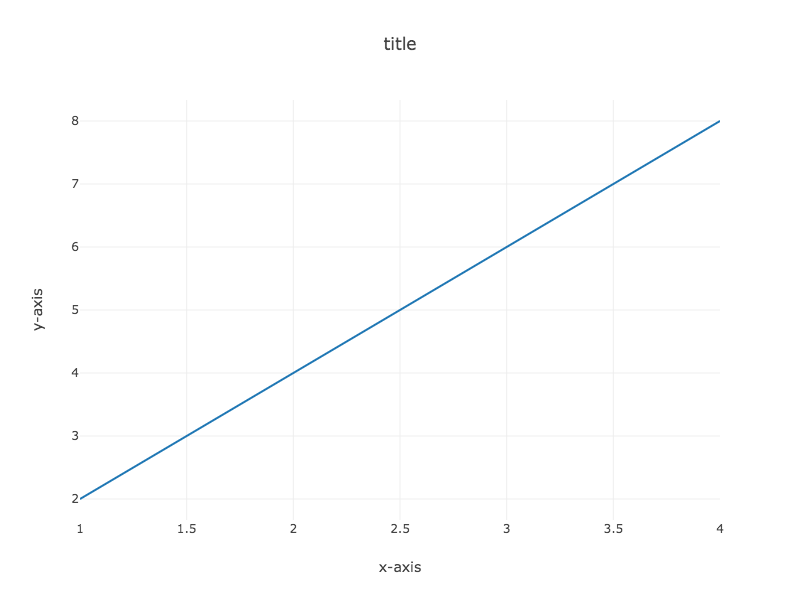

## CS106 Lab 7: Complexity, Hash Tables, and Sorting

### Due: May 11, at 11:59pm

---

## Overview

In this lab we'll be exploring the complexity ("runtime") of different algorithms for the same task: deduplication.
In deduplication, we seek to identify elements that are "equal" in some way, and remove them from our dataset. Specifically,
we will be looking at the impact of "duplicates" in voter registration records. Throughout, we will think about
the efficiency of programs as tied to their energy consumption. Although the exact relationship is complex, programs
that take longer to run generally use more energy - thus improving the runtime not only gives us faster results, it's
important for sustainability too.

Part 1 is a warmup to get practice timing methods and plotting the results. Think of this part as a pre-lab, and
it would be ideal to complete it before or during lab this Friday (April 17).

---

## Part 1: Pre-lab runtime warmup

We'll start by setting up a few methods and workflows that will be useful for the later steps of this lab.  It's up
to you how to organize and name these variables and methods (think about whether your methods should be public or private
as well). The high-level goal is to plot the runtime of a **recursive Fibonacci method**.

1. Create a new class in your source folder. I would recommend a name like `Util.java` (for "utility") or `Plotting.java`.
This class will contain methods for timing and plotting method runtimes.

2. Create a `main` method inside this class. Here is a top-down design outline for how we'll
time methods. We first capture the current time, run a potentially time consuming method (like Fibonacci), then
end the timer. Based on the start and end time, we compute the number of seconds elapsed.

~~~
start = startTimer()
result = fib(n)
end = endTimer()
timeSec = secondsElapsed(start, end)
~~~

3. Make methods that allow you to start a timer, end a timer, and
get the number of seconds that elapsed using the [Java System class](https://docs.oracle.com/javase/7/docs/api/java/lang/System.html). (Note there is not really any difference between starting and ending a timer, but it can make your code
    more readable.)

4. Create a recursive method that returns the `n`th Fibonacci number when given `n`. When `n=0` or `n=1`, the return
value should be 1. After that, the `n`th Fibonacci number is the sum of the previous two Fibonacci numbers. For this
pre-lab I would recommend writing a very generic Fibonacci method, but you could also experiment with tail recursion
to speed up the runtime.

5. Then use the methods you've built to time your Fibonacci method for a variety of `n` values (using a loop).

6. Make a method that can plot the value of `n` on the x-axis versus the runtime (in seconds) on the y-axis.  You can do
this using a library called `Tablesaw`.  First add the Maven dependencies to your `pom.xml` (they should be there already,
    but just in case there are issues):

~~~
<dependency>
<groupId>tech.tablesaw</groupId>
<artifactId>tablesaw-core</artifactId>
<version>0.38.0</version>
</dependency>

<dependency>
<groupId>tech.tablesaw</groupId>
<artifactId>tablesaw-jsplot</artifactId>
<version>0.38.0</version>
</dependency>
~~~

Then you can use `LinePlot` to graph it.  Here's a small example of how that works:

~~~
double[] xvals = {1, 2, 3, 4};
double[] yvals = {2, 4, 6, 8};

DoubleColumn column1 = DoubleColumn.create("x-axis", xvals);
DoubleColumn column2 = DoubleColumn.create("y-axis", yvals);

Table table = Table.create("for plot");
table.addColumns(column1, column2);
Plot.show(LinePlot.create("title", table, "x-axis", "y-axis"));
~~~

If you have multiple algorithms you would like to compare (as you will later in this lab), you can add series to the
graph so that there are multiple colors as in the below example:

~~~
double[] xvals = {1, 2, 3, 4, 1, 2, 3, 4};
double[] yvals = {1, 2, 3, 4, 1, 4, 6, 8};
String[] categories = {"a", "a", "a", "a", "b", "b", "b", "b"};

DoubleColumn column1 = DoubleColumn.create("x-axis", xvals);
DoubleColumn column2 = DoubleColumn.create("y-axis", yvals);

StringColumn catcolumn = StringColumn.create("algorithm", categories);
Table table = Table.create("for plot");
table.addColumns(column1, column2, catcolumn);
Plot.show(LinePlot.create("title", table, "x-axis", "y-axis", "algorithm"));
~~~

In addition to loading the correct data into the above table, you should be sure to customize your axis and graph titles appropriately based on the data you're graphing. Don't worry about logging warning messages, unless this prevents you
from viewing the plot. It should come up in your browser and you can click the camera icon to save it as a `png` file.

7. Hand in your work for this section by saving your resulting graph as the file `fibonacci.png` and adding, committing, and
 pushing that to the top level of your directory structure for this lab.  Try to choose a good max `n` value so that it
doesn't take too long, but you can still see the shape of the curve. Think about the theoretical runtime if you have time!

 

---

## Part 2: Data Deduplication

### Use of "remove" in the deduplication methods is NOT allowed

One important, and potentially expensive (in terms of efficiency and energy consumption), task when handling data
is data deduplication. The goal of this task is to make sure that each item in your data set (e.g., each person) only
appears once. We'll explore 3 different ways this can be done in this lab, and determine which one is most efficient.

### 2.1 The Data: Voting Rolls

In the United States, in order to vote in elections you must be registered to vote.  States must regularly update these
 voting rolls in order to account for deaths and newly registered voters.  Some states additionally regularly audit their
  voting rolls and remove voters based on various rules -- many of these rules have been criticized for being unnecessarily
   harsh and purposefully suppressing the vote.  In the 2018 election in Georgia, an "exact match" rule was instituted to
    require a voter's name as listed on their government-issued ID (e.g., their drivers license) to exactly match their name
     as listed on the voting rolls.  Voters whose names did not match exactly were removed from the voting rolls.  See more
      information about the policy, the racial disparity caused by this rule, and one attempt to fix it [here](https://www.washingtonpost.com/news/monkey-cage/wp/2018/10/20/georgias-exact-match-law-could-disenfranchise-3031802-eligible-voters-my-research-finds/).

Ideally, to examine the impact of such a rule, we would count the number of people we could duplicate between voting rolls
 and voter ID lists.  While voting rolls are public, we don't have access to voter ID lists, so instead we'll focus
 solely on deduplication of voting rolls.  We'll be looking at the Ohio statewide voter rolls, available
 [here](https://www6.ohiosos.gov/ords/f?p=VOTERFTP:STWD:::#stwdVtrFiles).  Each row in the data represents a single
  registered voter, and the attributes (columns) include their name, address, and other voting information.  The
  statewide information is divided by county across 4 files - throughout this assignment it's fine to use any of
  those 4 files or to combine them all into a single file if you'd prefer. Note that you'll need to create a way to programmatically read in a
  given file (just one) for testing.

I have provided smaller subsets of these files in the starter code:

~~~
vote_files/SWVF_1_22_short.txt
vote_files/SWVF_23_44_short.txt
vote_files/SWVF_45_66_short.txt
vote_files/SWVF_67_88_short.txt
~~~

There are larger files in my public directory (use ssh to access). These were too big to
include with the github repositories. **Make sure not to commit and push them!** Just put them
in the `vote_files` folder.

Edit: you can also access these files from the [Shared Google Drive folder](https://drive.google.com/drive/folders/1m3ZQEFMVSLzL-BC3qnRieLtZEk3r_u3e?usp=sharing).

~~~
$cd /homes/smathieson/Public/cs106/vote_files
$ls
SWVF_1_22_med.txt
SWVF_23_44_med.txt
SWVF_45_66_med.txt
SWVF_67_88_med.txt
~~~

And the very large files (full data) is available at the link above, but it may be too large to run on your machine.

### 2.2 Determining Equality

The deduplication goal we will consider here is to collect a list of *individuals* who are eligible to vote. We will explore
one type of equality method and how it could lead to false deduplication (i.e. saying two people are the same based on their
voting records, when in reality they are two separate people). This can happen even if we consider many fields - for
example, two people could share both a name and an address if they are members of the same family.

In order to determine if two rows contain the same person, we need to develop a method that checks the information that
 should be unique to each person and compares it to determine equality.

#### Requirements

1. Create an class that will hold the information for a single row from the CSV.  This object does **not** need to hold all
 fields in the CSV - you should store only the fields that will be necessary in order to deduplicate the data or print
 out other relevant information for debugging purposes. Make sure to have a constructor that takes in a `String[]`
 representing the row.

2. Implement the `Comparable` interface by making a `compareTo` method in the object you just created that returns 0 if and
 only if the compared items are the same person. To make our results consistent, for the main part of this lab we will use
 only the first and last name in the `compareTo` method. This is meant to simulate a naive equality method that could
 prevent people with the same name from voting. To determine order in this case (which we will need for sorting), we will
 first alphabetize by last name, and then by first name.

3. Project only: explore one or more other types of equality methods. Provide a short writeup of how the deduplication results change based on your equality method in your `README`.

### 2.3 Data Storage

Make a class to store the full data set.  Your constructor for the class should take the name of a CSV file as
input and should do the work of reading in the data from the CSV and parsing it into an `ArrayList` containing the
objects you developed in the previous section (not deduplicated yet).  Recall that you can use the `opencsv` library to do
 much of this work for you.

### 2.4 Deduplication Methods

 You will add three data deduplication methods to the data set class you created in the previous section.  Each of these methods should return an `ArrayList` of your designed objects that contains only the non-duplicated individuals who were
 in the voting rolls. Note that a good sanity check for these methods is that the `ArrayLists` they return should all
 be the same size (i.e. they should all deduplicate the same set of elements, just in different ways).

#### All Pairs Deduplication

 One way to find the number of duplicates in a data set is to compare each item to each other item in the data set,
 counting duplicates as you go. Make sure not to count the comparison of an item to itself as a duplicate.  We will
 call this the "all pairs" method of data deduplication.

#### Requirements

1. Create a method that uses this "all pairs" deduplication algorithm to return the non-duplicate items in a given data set.  The method signature should be:

~~~
ArrayList<E> allPairsDeduplication()
~~~

where `E` can be substituted with the specific object you have created to store a single row.

#### Hash Table Deduplication

Another way to find the number of duplicates is to create a key for each item in the data set and insert these items into a
 `HashMap`, with the count of the number of times this item is seen OR the object you created to store one row as the value. The choice of key will determine whether
  two items are considered to be duplicates, so choose it to match your `compareTo` method.

2. Create a method that uses this hash table algorithm of deduplication to return a list of non-duplicate items in a given data set. You may use the `ProbeHashMap.java` from the book, also included in your starter files. Your program should first create a `ProbeHashMap` with the capacity `N=1,000,003` and then insert the items into this hash table.

  The deduplication method signature should be:

~~~  
ArrayList<E> hashLinearDeduplication()
~~~

where `E` can be substituted with the specific object you have created to store a single row.

Project only (but know what these values represent for the exam): Besides the list of non-duplicates, also collect the following statistics about hashing: average number of probes during insertions, max number of probes during insertions, and load factor after insertions. Note that you will need to update `ProbeHashMap` class to compute these values. Print out these statistics once after you have inserted all elements into the hashtable in the following format:

~~~
Average number of probes: XXX
Max number of probes: XXX
Load factor: XXX
~~~

*Edit to add a hint: you can modify the `findSlot` method in `ProbeHashMap` to keep track of the number of probes. You are also welcome to add
 instance variables and getters to this class.*

#### Sorting for Deduplication

The last method for deduplication that we'll look at involves sorting the data in order to check for duplicates.  
Note that the comparison method you use will play an important role in determining if you correctly find the duplicates.
 First, we'll need some functions that allow us to sort.

3. Write a method to perform quicksort on your data.  You may find the fact that you implemented the `Comparable` interface useful. Your quicksort method should be **in-place** which will change the order of the original dataset! Not necessarily
a problem, but something to keep in mind. Your quicksort method should be **recursive** with the pivot chosen as the
first element in each subarray, and generally follow the outline we've talked about in class.
The deduplication part (which can be a separate method from the sorting part) should have signature:

~~~
ArrayList<E> quicksortDeduplication()
~~~

where `E` can be substituted with the specific object you have created to store a single row.

4. Project only: Java has a library with an already implemented sort method. Compare your quicksort
method with this builtin method (in terms of runtime). Write a method that uses `Collections.sort()` to sort your data.
The method signatures should be:

~~~
ArrayList<E> builtinSortDeduplication()
~~~

where `E` can be substituted with the specific object you have created to store a single row. Make sure to run
either quicksort **or** this builtin method (so that in-place quicksort does not already do the work of sorting).

Edit: make sure to include this new sorting method in a new runtime figure with 4 curves on the same plot.

---

## Part 3: Complexity Analysis

Using the methods you developed from the pre-lab part of the lab, you'll now explore the complexity of the deduplication
 methods you've developed in terms of runtime (as a proxy for energy consumption).  The answers to these questions should be
 given in your `README`. Note that this process can be orchestrated outside of `Main.java` (perhaps in your `Util.java` or
`Plotting.java` file). You can run your program multiple times and store the information for later plotting - you don't have
to produce the plot all in one run.

### Requirements

1. How many seconds does each duplication counting method take when run on one of the given datasets? Explain which dataset
you used - try to use the largest one you can without running out of memory or patience.

2. Create a graph showing the number of rows deduplicated on the x-axis and the runtime (in seconds) on the y-axis for each of these methods (where each method is a series on the graph).  **Save the graph** as the file `deduplication.png` in your repository and be sure to **git commit and push** to submit this graph. Note that this will require a way to vary the
number of rows you're reading/using from any given file. Again try to use the largest numbers you can so you're able
to see a pattern.

3. Interpret your results. Explain which deduplication method is most efficient in your `README`, and provide a theoretical
explanation of the runtime in big-O notation.

---

## Part 4: Command Line Input

You will receive a voting records file on the command line as a single argument like this:

~~~
SWVF_1_22.txt
~~~

You should process that file as described above and print the following information out in response.
Numbers below are examples.

~~~
Records given:2000
Attributes checked:X,Y,Z
Duplicates found:100
~~~

where in this example you were given 2000 lines of voting records, determined equality based on attributes X, Y, and Z, and found 100 duplicates in the data (i.e., deduplication returned a list of length 1900).  Note that we may choose to test your work using data from different counties or a different date, so be sure to actually read the data in from the command line.  Be sure to print out the *exact* name of the attributes checked as given in the first row of the CSV file. For the main part of the lab, these will be the first and last name.

### Requirements

1. Read in a CSV file from the command line input.
2. Deduplicate the data and print out the results formatted as above.

 

---

## Optional Extension

Implement a `DoubleHashMap` class which extends `AbstractHashMap` and implements a hash table that supports double
hashing on collision. Note that you will need to define a secondary hash function for this part. Then create a
 `DoubleHashMap` and repeat the above.

The deduplication method signature should be:

~~~
ArrayList<E> hashDoubleDeduplication()
~~~

where `E` can be substituted with the specific object you have created to store a single row.

Did the hashing statistics change in comparison to the linear probing hash table? Discuss in your `README`.  
